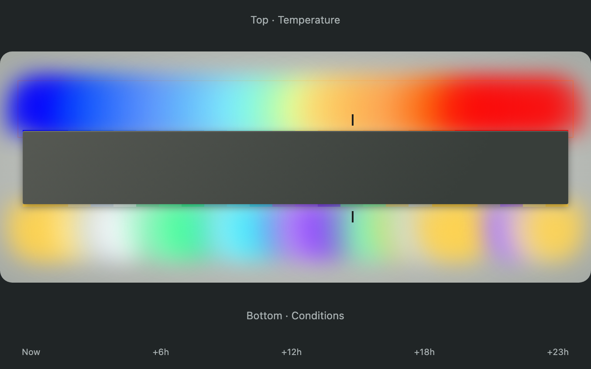
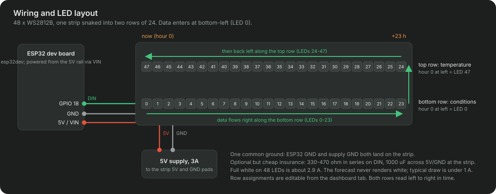
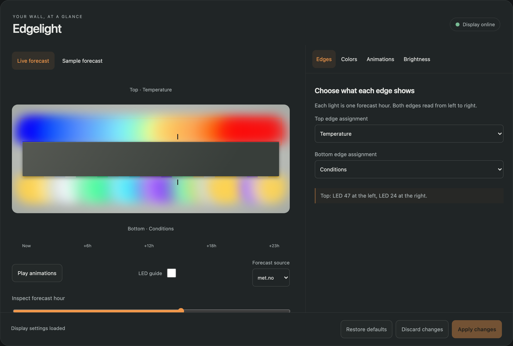
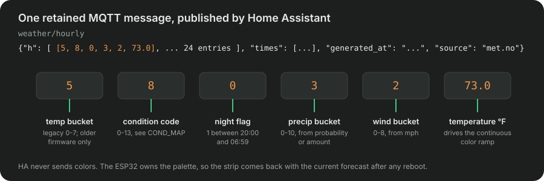

# weather-display

ESP32 + WS2812B (48 LEDs) wall-art weather station, fed by Home Assistant.

<!-- Hero: photo of the strip on the wall goes here (docs/img/hero.jpg), then the timelapse GIF. -->


Each LED is one hour of the next 24. The top row is temperature, the bottom
row is sky conditions. "Now" is at the left end of each row; tomorrow at this
time is at the right. Storm hours flash yellow, windy hours shimmer, and the
sunrise and sunset cells breathe.

Home Assistant publishes forecast categories and temperatures over MQTT every
15 minutes. The ESP32 applies the Android app's default color rules from
`include/weather_colors.h`:

- Temperature blends smoothly between color stops at 0, 20, 32, 50, 65, 78
  and 90°F using OKLCH interpolation. Colder/hotter values hold the end colors.
- Conditions use sunny yellow, partly cloudy gold-gray, cloudy blue-gray,
  near-white fog, green rain, teal-blue snow and violet sleet.
- Wet hours use three strengths: buckets 1–3 are light, 4–7 medium, 8–10 heavy.
  The color gets darker as strength increases. Dry conditions keep their color.
- Conditions render the same color day and night. Missing conditions stay off.

Wind and lightning retain their existing LED animations. The strip also retains
its global night brightness setting and HA's 20:00–07:00 night-time estimate.

To update an existing installation, flash the firmware, replace the HA Python
script, then run **Weather Display - Publish Forecast**. Both updates are needed
for smooth temperature colors. Physical LED appearance still needs an on-device
check; these defaults use the same RGB values as the app.

## What this assumes

Everything here runs on a stock Home Assistant OS install, but some choices are
baked in. Know them before you build:

- **48 LEDs in two rows of 24.** Firmware, dashboard card and preview all
  assume this shape. Which corner LED 0 sits in, and whether the strip snakes,
  is a setting in the dashboard tab. A different LED count means edits in
  `src/main.cpp`, `include/display_engine.h` and `web/display-model.js`.
- **Hourly forecasts over `weather.get_forecasts`.** met.no (built in) and NWS
  are tested. Other integrations work if their condition strings are in
  `COND_MAP`; unknown strings render off. Units and timestamp offsets are
  normalized on the HA side.
- **Night is 20:00-06:59 local**, fixed in the publisher. It only drives the
  strip's global night brightness and the sunrise/sunset breathing cells.
- **Fahrenheit and mph** for the palette stops, the legacy buckets and the wind
  threshold. Temperatures are converted from °C on the HA side; metric users
  move the color stops in the dashboard tab rather than editing code.
- **MQTT topics are fixed** under `weather/`. You need a broker HA can reach
  (the Mosquitto add-on is the easy path) and the `python_script:` integration.
- **The installer wants SSH.** `scripts/install-ha.py` edits dashboard storage,
  so it needs the SSH add-on and stops HA core for about 30 seconds. Without
  SSH, everything it does can be pasted by hand (see step 6).

## Build one

Order of operations for a first build: parts, wire, mount, then the software
side. Software steps assume Home Assistant OS with the Mosquitto add-on.

### Parts (about $40 before the mount)

| Part | Notes | Approx. |
|------|-------|---------|
| ESP32 dev board | `esp32dev` in `platformio.ini`; change `board` for other modules | $8 |
| WS2812B strip, 60 LEDs/m, 1 m | Cut to 48. SK6812 works too (`LED_TYPE`) | $12 |
| 5V supply, 3A | Barrel jack or USB-C PD trigger; shares GND with the ESP32 | $10 |
| Wire, connectors, 330-470 ohm resistor, 1000 uF cap | Resistor in series on data, cap across 5V at the strip. Both optional at 48 LEDs, both cheap insurance | $5 |
| Mount | Aluminum LED channel with a frosted diffuser reads best. Two 60 cm lengths, or a routed board | varies |

Software: Home Assistant with the Mosquitto broker add-on (or any MQTT broker
HA is connected to), a weather entity with hourly forecasts (met.no is built
in; NWS if you are in the US), and [PlatformIO](https://platformio.org/) to
build and flash. Node is only needed for the dashboard tab.

### 1. Wire it



- ESP32 `GPIO 18` to the strip's `DIN` (`DATA_PIN` in `src/main.cpp`).
- Supply `5V` to the strip's `5V` and to the ESP32's `5V`/`VIN`; supply `GND`
  to both. One common ground, always.
- Do not power the strip from the ESP32's 3.3V rail. If you would rather run
  the ESP32 from USB, leave `VIN` disconnected and share only `GND` and `DIN`;
  never feed `VIN` and USB at the same time.
- Full white on 48 LEDs is about 2.9A. The forecast never renders white, so a
  3A supply has headroom; typical draw is under 1A.

### 2. Mount it

Cut the strip after LED 23 and rejoin with three short jumpers so the two
halves sit as parallel rows, or fold the strip at the right edge if your
channel allows it. Either way the data path is a snake:

```
Bottom row (LEDs  0..23): physically L -> R. Hour h at LED h.
Top row    (LEDs 24..47): physically R -> L. Hour h at LED (47 - h).
```

That is the default: LED 0 bottom-left, LED 47 top-left. Hour 0 is the
current hour at the left end of both rows; +23h is at the right. By default
the top row shows temperature and the bottom row conditions.

Wired yours differently? Nothing to recompile. In the dashboard tab, under
**Edges > Strip wiring**, pick the corner where LED 0 sits and whether the
strip snakes back on the second row, then turn on the LED guide and check the
numbers against your strip. The layout is stored on the device with the rest
of the settings (`layout: {origin, serpentine}`).

### 3. Home Assistant

Everything HA needs is in `ha/`:

| File | Where it goes |
|------|---------------|
| `ha/python_scripts/weather_display_publish.py` | `/config/python_scripts/` (create the folder if needed) |
| `ha/scripts.yaml` | Append to your `scripts.yaml`. Change `weather.forecast_home` and `weather.nws_home` to your met.no and NWS entities. |
| `ha/automations.yaml` | Append to your `automations.yaml`. |
| `ha/configuration.yaml` | Add `python_script:` to `configuration.yaml`. The `mqtt: sensor:` block is optional. |

Restart HA. Then run the script **Weather Display - Publish Forecast** once
from Settings > Automations & Scenes > Scripts. You should see a retained
message on the `weather/hourly` topic (MQTT add-on > Configure > Listen to a
topic).

### 4. Firmware

```bash
cp include/secrets.h.example include/secrets.h   # WiFi + MQTT credentials
pio run -t upload && pio device monitor            # first flash over USB
```

The first flash installs an ArduinoOTA listener. After that, flash over WiFi:

```bash
pio run -e esp32dev-ota -t upload
```

Set the device IP in `platformio_local.ini` (gitignored, see the comment in
`platformio.ini`). Reserve the IP in your router so it doesn't move. OTA is
dual-bank, so a failed flash leaves the previous firmware intact, and the
firmware blanks the LEDs during an OTA so FastLED isn't fighting the flash.

### 5. First boot

The strip shows a slow blue breath on LED 0 until the first MQTT message
arrives. Once the retained payload lands (a second or two after connecting)
the full forecast appears.

### 6. Dashboard tab (optional)



A Lovelace card mirrors the wall and edits its settings: edge assignments,
temperature stops, condition colors, the three animations, day/night
brightness, and the met.no / NWS source picker. The preview uses the same
color math as the firmware, so what the card shows is what the strip shows.

```bash
npm install && npm run build
python3 scripts/install-ha.py --host root@ha.local --dashboard dashboard_desktop           # dry run
python3 scripts/install-ha.py --host root@ha.local --dashboard dashboard_desktop --install
```

`--dashboard` is the storage suffix of the dashboard to add the tab to
(`/config/.storage/lovelace.<suffix>`). The installer copies the card to
`/config/www/edgelight/<stamp>/`, registers it as a module resource, adds an
"Edgelight" panel tab, installs `ha/display-editor.yaml` as a package (MQTT
sensors, `input_select.edgelight_weather_source`, `script.edgelight_apply`),
and writes the publisher. It backs up every file it touches.

By hand instead: copy `dist/` to `/config/www/edgelight/`, add
`/local/edgelight/edgelight-card.js` as a module resource, add a panel view
with one `custom:edgelight-display-card` card, and include
`ha/display-editor.yaml` as a package.

## MQTT topics

### `weather/hourly` (retained, published by HA)



```json
{"h": [[temp_bucket, cond_code, is_night, precip_bucket, wind_bucket, temperature_f], ... 24 entries]}
```

| Field | Range | Meaning |
|-------|-------|---------|
| `temp_bucket` | 0-7 | `0 unknown, 1 <20°F, 2 20-31, 3 32-49, 4 50-64, 5 65-77, 6 78-89, 7 90+` |
| `cond_code` | 0-13 | Stable HA wire codes mapped to seven visual categories; see below. |
| `is_night` | 0/1 | 20:00-06:59 local. Drives global night brightness and the sunrise/sunset breathing hours. No per-cell dimming. |
| `precip_bucket` | 0-10 | From `precipitation_probability` (10% bands), falling back to amount in mm. Selects light/medium/heavy treatment on wet hours only. |
| `wind_bucket` | 0-8 | Wind speed normalized to mph, then banded. Scales the shimmer amplitude. |
| `temperature_f` | number or null | Actual temperature in °F, converted automatically from °C. Null means no data. |

The first five fields retain their meaning for older firmware. Updated firmware
also accepts older 2-, 3- and 5-field payloads, using the first field's temperature
bucket when the sixth field is absent. Missing precip/wind values default to off.
Temperature, wind and precipitation units are read from the weather entity;
missing units default to °F, mph and mm.

Condition codes: 0 unknown, 1 sunny, 2 clear-night, 3 partlycloudy, 4 cloudy,
5 windy, 6 windy-variant, 7 fog, 8 rainy/pouring, 9 snowy, 10 snowy-rainy,
11 lightning/lightning-rainy, 12 exceptional, 13 hail. Clear-night uses sunny's
color with night treatment. Windy uses sunny, windy-variant uses cloudy, and
hail uses sleet. Thunder uses rain plus lightning. Exceptional has no known
sky category and stays off; it no longer paints an alert-red condition cell.

### `weather/display/mode` (retained, plain string)

`"forecast"` or `"demo"`. Demo mode walks every palette color side by side so
you can check wiring and color order. The publish script sets `forecast` on
every refresh, so a device left in demo returns to the forecast within 15
minutes.

## Animations

- **Sunrise / sunset breathe.** The temperature cells at the day/night
  transitions dip and recover once every 6 seconds.
- **Wind shimmer.** Windy hours flow with Perlin-noise brightness; amplitude
  scales with `wind_bucket`.
- **Lightning.** Storm hours render as rain with a yellow bolt blended on top
  on a ~12.7 second cycle (rumble, build, peak, flicker, decay).

## Firmware structure

Color rules are in `include/weather_colors.h`; hardware and animations are in
`src/main.cpp`:

- `TEMP_PALETTE`, `CONDITION_PALETTE`, `WET_COLORS`: Android default colors
- `LIGHTNING_BOLT`: animation overlay color
- `renderForecast()` / `renderDemo()`: build the static frame
- `applyBreathing()` / `applyWind()` / `applyLightning()`: per-frame overlays
- `onMqtt()`: parses both topics and handles the mode switch

Keep `COND_MAP` in `ha/python_scripts/weather_display_publish.py` in step with
the condition enum in `src/main.cpp`. A new condition needs both.

## Verification

```bash
pio run -e esp32dev
python3 -m unittest discover -s tests -v
npm test && npx playwright test
```

The Python tests compile the portable color rules with a host C++ compiler and
exercise the HA publisher with fake forecast data. The Node and Playwright
tests drive the card against a fake `hass` and check its preview against the
real firmware renderer. No broker or device is contacted.

## Related

The same idea, ported to a phone: [Edgelight Weather](https://play.google.com/store/apps/details?id=com.adamrho.edgelight)
is an Android live wallpaper that renders the 24-hour forecast as a glow
along the screen edges.

## License

MIT. See `LICENSE`.
